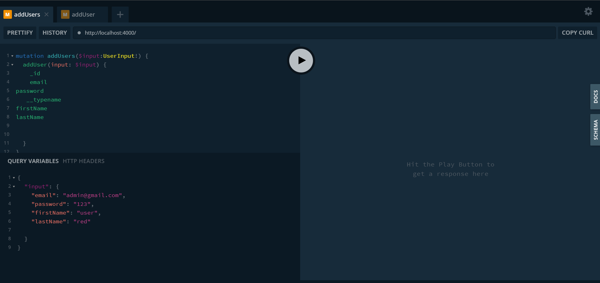
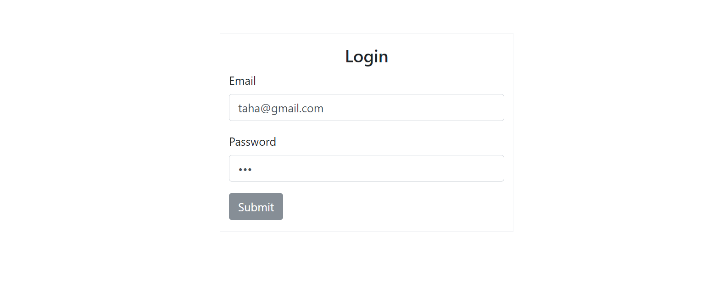
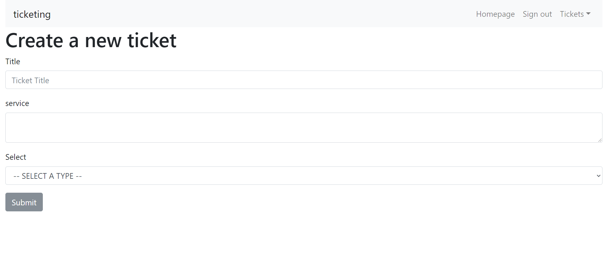
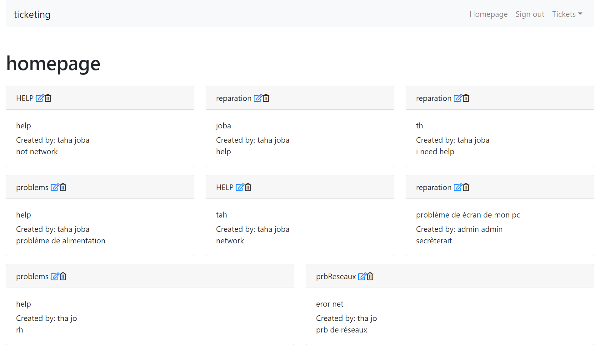
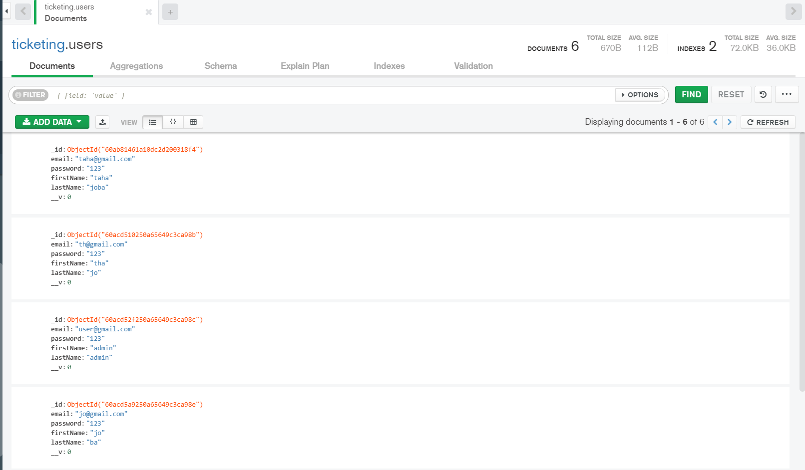
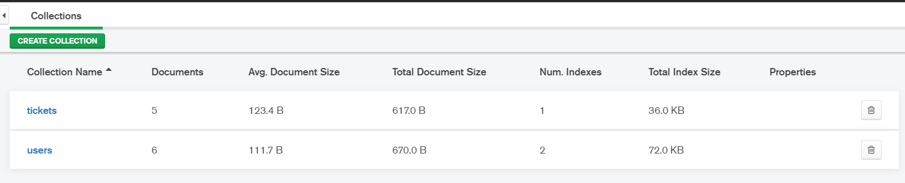

# NOTE
This repository is still undergoing development. and not ready to be used yet.
## Progress so far
1) Defined GraphQL Schema
2) Connected GraphQL schema to MongoDB for data persistence using mongoose
3) Validate user authentication using ApolloServer
4) Authenticate users using jwt
5) Connect React app to redux store
6) React query ApolloServer using ApolloClient

# Application
A simple ticketing system where multiple users create and assign tickets and update ticket statues

# Implementation
The system exposes ApolloServer using NodeJs. Using schemas to define GraphQL and Mongoose to persist data to MongoDB server.

As a front-end, react connects to the ApolloServer using react-apollo and using Bootstrap 4 implements the UI of the ticketing system.

# Installation notes
## Dependencies
Install `concurrently`
        
    sudo npm install -g concurrently
Install `mongodb`
        
    sudo apt install mongodb-server-core

Install `nodemon`
    sudo npm install -g nodemon
Install `apollo`

    npm i -g apollo@2.4.4
## ReactStrap: Bootstrap 4
    npm install --save bootstrap
    npm install --save reactstrap

# Generating the types from schema
    apollo schema:download --endpoint http://localhost:4000 schema.json    
    apollo client:codegen --localSchemaFile schema.json --target typescript __generated__

# picteur of project

# Create From 
                                                                           Taha Esselmouni
